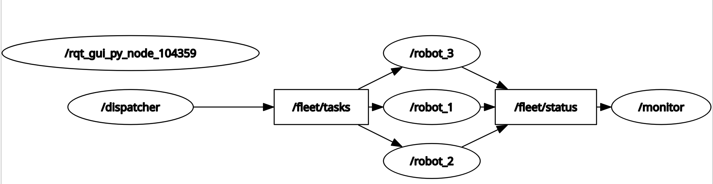
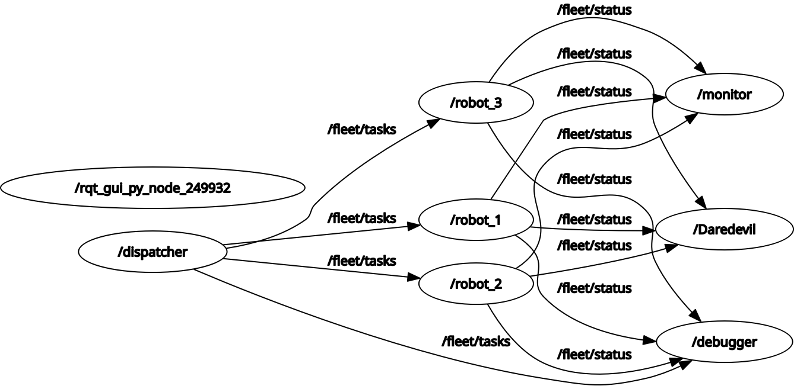

1. Group members: names and UIDs.

Kyle DeGuzman (120452062), Stephen Snelson (12254074)

2. Contributions: a brief description of each team member’s contributions (e.g., which nodes each person implemented, who wrote the launch files, who handled QoS configuration).

Kyle: Implemented nodes robot_1, robot_2, and robot_3, along with their respective entry points (main functions) to start those nodes. Detailed docstrings and comments were added as well. Testing with all nodes together was done to fix the remaining issues of robot_2 not queuing tasks and robot_3 not starting five seconds late as needed. Fixes were made to system.launch.py to fix these issues. Fixed logger statements and node shutdown logic in main functions so no errors would occur.

Stephen: Implemented dispatcher, monitor, debug, and mismatch nodes along with their respective entry points (main functions) to start the nodes. Created launch file, launch groups, and launch conditions for robot_2, debugger, and mismatch. Debugged code to meet specification requirements and performed testing for the various nodes.

3. Scenario chosen: which scenario and a one-paragraph summary.

Scenario 2 (Robot Fleet Dispatcher) was chosen. This involves three nodes, robot_1, robot_2, and robot_3, which subscribe to the /fleet/tasks topic and filter out tasks for its applicable ID and simulate task execution with different timer callbacks. Tasks are received from dispatcher, which publishes the String tasks to /fleet/tasks and cycles through robot IDs in round robin order. The robots publish their status (containing ID, status, and task) to /fleet/status, which the monitor node is subscribed to. The monitor node tracks the number of completed tasks for each robot, tracks the last status timestamp, and publishes a String summary to /fleet/report. It also warns for any robot that has not reported in 5 seconds. The debug_logger is a subscriber only node subscribed to topics /fleet/tasks and /fleet/status to log all messages. The mismatch_subscriber is a node subscribed to /fleet/status using RELIABLE rather than BEST_EFFORT to show the Quality of Service Mismatch error.

4. Node graph: a text or diagram showing all nodes, topics, message types, and QoS profiles. You may use a tool like Mermaid or a screenshot of rqt_graph.

5. Design decisions: explain your choice of QoS profiles, callback groups, and executor types.

All three robot nodes use a QoS subscriber profile with depth=5, ReliabilityPolicy.RELIABLE, DurabilityPolicy.TRANSIENT_LOCAL, and HistoryPolicy.KEEP_LAST. A depth of 5 is ideal for strings of tasks since it allows queuing up to 5 if the node is still busy. A RELIABLE policy is ideal for strings of tasks since every task MUST be delivered (this is not a high frequency sensor stream where it’s okay for data to be lost) and this policy guarantees delivery. A TRANSIENT_LOCAL policy is necessary to account for any robots that join late; this guarantees they still receive the message upon joining (as is demonstrated with robot_3 which joins 5 seconds late). KEEP_LAST was chosen since the most recent (last 5) tasks sent and received are the most relevant, and because using KEEP_ALL could eventually consume excessive memory and cause crashes. The QoS publisher profile for all three robots have depth=3, ReliabilityPolicy.BEST_EFFORT, and DurabilityPolicy.VOLATILE. The reason for choosing these profiles is mostly due to the robot nodes publishing to /fleet/status, which the monitor node was subscribed to. A value of depth=3 was used since a smaller depth is better to reduce latency from 3 robots as a larger queue would result in higher latency for the monitor node. A BEST_EFFORT policy was used for a similar reason of reducing latency that would otherwise cause the monitor node to be delayed from real timing. A VOLATILE policy is chosen here since the monitor node does not need to have old information if it joins late; this policy only provides the node the most relevant information occurring at the moment. A MutuallyExclusiveCallbackGroup() was chosen for all three robot nodes due to them having both timer and subscriber callbacks (due to their bidirectional nature); this callback group was necessary to prevent race conditions.

The administative nodes each have specific quality of service profiles. 
    The dispatcher node issues task messages on /fleet/tasks and uses  QoS metrics: depth=5, RelabilityPolicy.RELIABLE, DurabilityPolicy=TRANSIENT_LOCAL. A depth of 5 ensure tasks can be queued for the robot to receive and execute even if unable to keep up. The RELIABLE policy ensure the tasks are delivered to the robot since tasks are not constantly dispatched to a robot such as a high-frequency sensor. TRANSIENT_LOCAL durability ensure robots which join late (such as robot_2 when started seperately) receive their tasks(even if they can't show up to work ontime). 
    
    The Monitor node receives status messages on /fleet/status from the robot team and issues report messages on /fleet/report. The QoS policy for /fleet/status is depth=3, relabilityPolicy.BEST_EFFORT, DurabilityPolicy.VOLATILE. Depth 3 ensure even if all robots submit a status simultaneously the messages can be queued and maintained. BEST_EFFORT policy allows messages to be received, since there is no guarentee of delivery, however, for a status update to the monitor not ever single message is required. VOLATILE is chosen since the monitor does not require the all the messages, just the most recent. The Qos Policy for /fleet/report is ReliabilityPolicy.RELIABLE, DURABILITY_POLICY.VOLATILE. Similar to the dispatcher node, the RELIABLE publishing ensure messages are delivered to the network. VOLATILE was choosen because if a node joins late, it only needs the most recent message and not all of them. The monitor node uses a MultiThreadedExecutor to handle the constant stream of data and not lose data due to the quantity of messages received simultaneously. A MutuallyExclusiveCallbackGroup (MECG) is used for the subscriber callback so that status-processing callbacks do not execute concurrently and create race conditions while accessing shared data. A ReentrantCallbackGroup (RCG) is used for the timer/publisher so that report publishing can occur without unnecessarily blocking other callbacks. This combination provides both safe handling of shared state and improved responsiveness.

    The Debugger node subscribes to both /fleet/tasks and /fleet/status and the QoS policies match the needs of the intended users, either the Robots or the Monitor nodes. Similarly, the Mismatch Subscriber node QoS policy was chose specifically to not match the needs of the messages intended users.

6. Build and run instructions: exact commands to build, source, and launch the system.

After downloading the .zip file, unzip it to your workspace with unzip group1_gp1.zip. 
Use "colcon build" at the root of the workspace then use "source install/setup.bash". 
To run an individual node, use "ros2 run group1_gp1 <node name>". To launch the entire system, use "ros2 launch group1_gp1 system.launch.py".
The Launch command has 3 preset arguments: 
            1. enable_debug:=true (false by default) to start the debug logger which prints every message on each topic
            2. enable_mismatch:=true (false by default) to start the mismatch subscriber to show the QoS mismatch error message
            3. start_robot_2:=false (true by default) to not launch robot_2 with the entire system. This is useful for verifying backlog and isolation to verify monitor node measuring non-responsiveness

7. Known issues: any limitations or incomplete features.

In regard to linting, there are no underlined lines from Ruff, but Pylance currently complains in all of the node files about not completely knowing the type of certain objects, although this is a known occurrence when working with ROS 2 and Python in VSCode.

8. Demos
TRANSIENT_LOCAL Demo:
    Robot_3 starts 5 seconds after system is launched. Robot_3 still receives the messages which were published prior to the node launching. Robot_3 still receives its backlog of tasks as the monitor class increments to include the completed tasks from the robot

Queue Overflow Demo:
    robot_2 sleeps for 2 seconds per task but receives tasks every 3 seconds. This is manageable. To demonstrate overflow, temporarily increase the dispatch rate or decrease the queue depth and document the observation in README.md.

    After increasing the node sleep timer from 2 seconds to 4 seconds, abnormal behavior was observed. Initially, the system appeared to operate normally, but after some time it became clear that tasks were being dropped from the queue. In effect, older queued tasks were overwritten by newer incoming tasks before they could be executed, so some issued tasks were never completed while later tasks were processed instead.