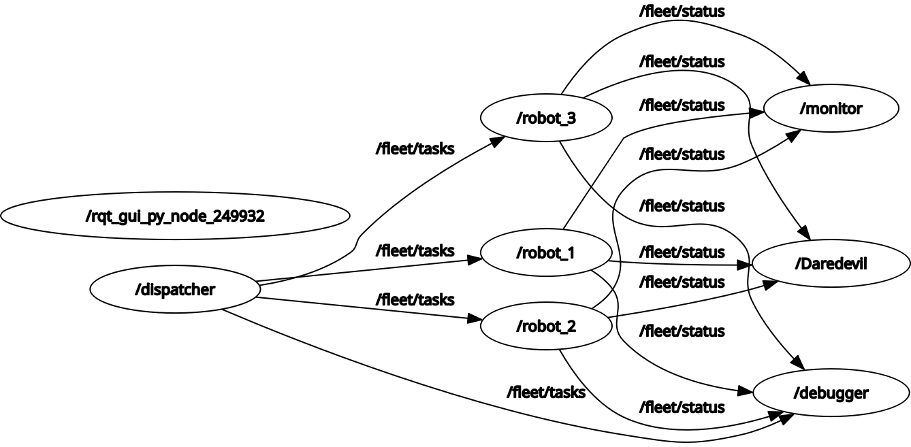

1. Group members: names and UIDs.

Kyle DeGuzman (120452062), Stephen Snelson (12254074)

2. Contributions: a brief description of each team member’s contributions (e.g., which nodes each person implemented, who wrote the launch files, who handled QoS configuration).

Kyle: Implemented nodes robot_1, robot_2, and robot_3, along with their respective entry points (main functions) to start those nodes. Detailed docstrings and comments were added as well. Testing with all nodes together was done to fix the remaining issues of robot_2 not queuing tasks and robot_3 not starting five seconds late as needed. Fixes were made to system.launch.py to fix these issues. Fixed logger statements and node shutdown logic in main functions so no errors would occur.

3. Scenario chosen: which scenario and a one-paragraph summary.

Scenario 2 (Robot Fleet Dispatcher) was chosen. This involves three nodes, robot_1, robot_2, and robot_3, which subscribe to the /fleet/tasks topic and filter out tasks for its applicable ID and simulate task execution with different timer callbacks. Tasks are received from dispatcher, which publishes the String tasks to /fleet/tasks and cycles through robot IDs in round robin order. The robots publish their status (containing ID, status, and task) to /fleet/status, which the monitor node is subscribed to. The monitor node tracks the number of completed tasks for each robot, tracks the last status timestamp, and publishes a String summary to /fleet/report. It also warns for any robot that has not reported in 5 seconds. The debug_logger is a subscriber only node subscribed to topics /fleet/tasks and /fleet/status to log all messages.

4. Node graph: a text or diagram showing all nodes, topics, message types, and QoS profiles. You may use a tool like Mermaid or a screenshot of rqt_graph.

5. Design decisions: explain your choice of QoS profiles, callback groups, and executor types.

All three robot nodes use a QoS subscriber profile with depth=5, ReliabilityPolicy.RELIABLE, DurabilityPolicy.TRANSIENT_LOCAL, and HistoryPolicy.KEEP_LAST. A depth of 5 is ideal for strings of tasks since it allows queuing up to 5 if the node is still busy. A RELIABLE policy is ideal for strings of tasks since every task MUST be delivered (this is not a high frequency sensor stream where it’s okay for data to be lost) and this policy guarantees delivery. A TRANSIENT_LOCAL policy is necessary to account for any robots that join late; this guarantees they still receive the message upon joining (as is demonstrated with robot_3 which joins 5 seconds late). KEEP_LAST was chosen since the most recent (last 5) tasks sent and received are the most relevant, and because using KEEP_ALL could eventually consume excessive memory and cause crashes. The QoS publisher profile for all three robots have depth=3, ReliabilityPolicy.BEST_EFFORT, and DurabilityPolicy.VOLATILE. The reason for choosing these profiles is mostly due to the robot nodes publishing to /fleet/status, which the monitor node was subscribed to. A value of depth=3 was used since a smaller depth is better to reduce latency from 3 robots as a larger queue would result in higher latency for the monitor node. A BEST_EFFORT policy was used for a similar reason of reducing latency that would otherwise cause the monitor node to be delayed from real timing. A VOLATILE policy is chosen here since the monitor node does not need to have old information if it joins late; this policy only provides the node the most relevant information occurring at the moment. A MutuallyExclusiveCallbackGroup() was chosen for all three robot nodes due to them having both timer and subscriber callbacks (due to their bidirectional nature); this callback group was necessary to prevent race conditions.

6. Build and run instructions: exact commands to build, source, and launch the system.

After downloading the .zip file, unzip it to your workspace with unzip group1_gp1.zip. 
Use colcon build at the root of the workspace then use source install/setup.bash. 
To run an individual node, use ros2 run group1_gp1 <node name>. To launch multiple nodes, use ros2 launch system.launch.py.

7. Known issues: any limitations or incomplete features.

In regard to linting, there are no underlined lines from Ruff, but Pylance currently complains in all of the node files about not completely knowing the type of certain objects, although this is a known occurrence when working with ROS 2 and Python in VSCode. 